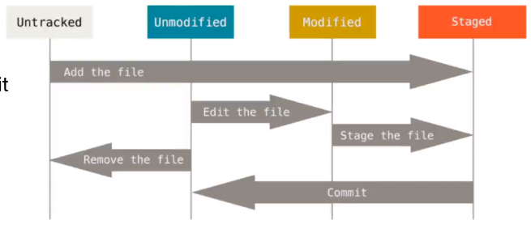

最先进的分布式版本控制系统。

**Workspace**：工作区
**Index / Stage**：暂存区
**Repository**：仓库区（或本地仓库）
**Remote**：远程仓库

- git status

  仓库当前的状态

- git add

  将文件提交到暂存区

- git commit -m

  将暂存区文件提交到仓库

- git diff ***

  检查文件是否被修改，检查修改内容

- git log

  查看